<p align="center">
  
</p>

<h1 align="center">AI Avatar X</h1>
<h3 align="center">Your Dominant AI Companion // Tu Compañera IA Dominante // 你的主宰AI伴侣</h3>

<p align="center">
  
  
  
  
  
  
</p>

<p align="center">
  <b>An interactive desktop AI avatar powered by Ollama with Glassmorphism UI, VHS aesthetics, and real-time emotion engine.</b><br>
  <i>Un avatar de escritorio interactivo potenciado por Ollama con interfaz Glassmorphism, estética VHS y motor de emociones en tiempo real.</i><br>
  <b>一款由Ollama驱动的交互式桌面AI虚拟形象，具有玻璃态界面、VHS美学和实时情感引擎。</b>
</p>

<p align="center">
  <a href="#features">Features</a> • 
  <a href="#quick-start">Quick Start</a> • 
  <a href="#configuration">Configuration</a> • 
  <a href="#translations">Translations</a> • 
  <a href="#demo">Demo</a>
</p>

---

<p align="center">
  
</p>

## 🌟 Features / Características / 功能特点

| English | Español | 中文 |
|---------|---------|------|
| **🤖 Local AI Processing** - Native Ollama integration with privacy-first LLM conversations using your own models | **Procesamiento IA Local** - Integración nativa con Ollama para conversaciones privadas usando tus propios modelos | **🤖 本地AI处理** - 原生Ollama集成，使用您自己的模型进行隐私优先的LLM对话 |
| **🎭 Makima Personality Engine** - Dominant, authoritative AI persona with dynamic emotional responses | **Motor de Personalidad Makima** - Persona IA dominante y autoritaria con respuestas emocionales dinámicas | **🎭 Makima人格引擎** - 具有动态情感回应的主导性、权威性AI人格 |
| **🎨 Glassmorphism UI** - Modern translucent interface with soft 24px corners and authentic VHS scanline effects | **Interfaz Glassmorphism** - Diseño moderno translúcido con esquinas suaves de 24px y efectos VHS auténticos | **🎨 玻璃态UI** - 现代半透明界面，24px柔和圆角和真实VHS扫描线效果 |
| **💭 Internal Thoughts Visualization** - Real-time AI reasoning displayed in elegant cyan analytical bubbles | **Visualización de Pensamientos Internos** - Razonamiento de IA en tiempo real en burbujas analíticas cyan | **💭 思维可视化** - 实时AI推理以优雅的青色分析气泡显示 |
| **🗣️ Multi-TTS Support** - Speech synthesis via Chrome, Speech Note, macOS Say, Festival, or eSpeak | **Soporte Multi-TTS** - Síntesis de voz mediante Chrome, Speech Note, macOS Say, Festival o eSpeak | **🗣️ 多TTS支持** - 通过Chrome、Speech Note、macOS Say、Festival或eSpeak进行语音合成 |
| **🎬 Smart Transitions** - Crossout, Fade, or Cut transitions with configurable duration (0.2s default) | **Transiciones Inteligentes** - Transiciones Crossout, Fade o Cut con duración configurable (0.2s por defecto) | **🎬 智能转场** - 交叉淡出、淡入或剪切转场，可配置时长（默认0.2秒） |
| **⚡ Performance Modes** - Low (Battery saver), Medium (Balanced), High (Maximum visual effects) | **Modos de Rendimiento** - Bajo (Ahorro batería), Medio (Equilibrado), Alto (Máximos efectos visuales) | **⚡ 性能模式** - 低（省电）、中（平衡）、高（最大视觉效果） |
| **🔧 Interactive Installer** - One-click setup with OS auto-detection and custom command configuration | **Instalador Interactivo** - Configuración en un clic con auto-detección de SO y comandos personalizados | **🔧 交互式安装器** - 一键设置，自动检测操作系统并配置自定义命令 |
| **🎞️ Rich Animation Library** - 15+ emotional states: happy, angry, annoyed, curious, excited, nervous, sad, sleepy, thinking, idea, wink, orgullosa, and idle loops | **Biblioteca Rica de Animaciones** - 15+ estados emocionales: feliz, enfadada, molesta, curiosa, emocionada, nerviosa, triste, somnolienta, pensando, idea, guiño, orgullosa, e idle loops | **🎞️ 丰富动画库** - 15+情感状态：开心、生气、恼怒、好奇、兴奋、紧张、悲伤、困倦、思考、灵感、眨眼、自豪和空闲循环 |

<p align="center">
  
</p>

## 🚀 Quick Start / Inicio Rápido / 快速开始

### Option 1: Interactive Installer (Recommended / Recomendado / 推荐)
```bash
# Clone the repository / Clona el repositorio / 克隆仓库
git clone https://github.com/xyz-rainbow/ai-avatar-x.git
cd ai-avatar-x

# Run interactive installer / Ejecuta el instalador interactivo / 运行交互式安装器
bash install.sh              # Linux/macOS
python interactive_install.py # Any platform / Cualquier plataforma / 任何平台
```

### Option 2: Manual Setup / Instalación Manual / 手动安装
```bash
# Create virtual environment / Crea entorno virtual / 创建虚拟环境
python3 -m venv venv

# Activate / Actívalo / 激活
source venv/bin/activate      # Linux/macOS
venv\Scripts\activate         # Windows

# Install dependencies / Instala dependencias / 安装依赖
pip install -r requirements.txt  # Flask 3.0.0, pywebview 5.0.5

# Run / Ejecuta / 运行
python run.py
```

### Launch Commands / Comandos de Inicio / 启动命令
```bash
# Default command (customizable) / Comando por defecto (personalizable) / 默认命令（可自定义）
makima

# Or use npm scripts / O usa scripts npm / 或使用npm脚本
npm start
npm run dev    # Debug mode / Modo debug / 调试模式
```

<p align="center">
  
</p>

## ⚙️ Configuration / Configuración / 配置

Edit `backend/config.json` or use the Settings panel (Settings button in avatar):

| Setting | Description | Descripción | 描述 | Default |
|---------|-------------|-------------|------|---------|
| `ollama_model` | Local LLM model | Modelo de IA local | 本地大语言模型 | `granite4:micro` |
| `ollama_url` | Ollama API endpoint | Endpoint de API Ollama | Ollama API端点 | `http://127.0.0.1:11434/api/generate` |
| `system_prompt` | AI personality prompt | Prompt de personalidad | AI人格提示词 | Makima persona |
| `thought_mode` | none/short/deep/creative | desactivado/breve/profundo/creativo | 关闭/简短/深入/创意 | `creative` |
| `transition_style` | crossout/fade/cut | crossout/fade/corte | 交叉淡出/淡入/剪切 | `crossout` |
| `performance_mode` | low/medium/high | bajo/medio/alto | 低/中/高 | `high` |
| `tts_provider` | chrome/speechnote/say/festival/espeak | chrome/speechnote/say/festival/espeak | chrome/speechnote/say/festival/espeak | `speechnote` |
| `language` | Interface language | Idioma de interfaz | 界面语言 | `es` (auto-detect) |

<p align="center">
  
</p>

## 🌍 Translations / Traducciones / 语言支持

<details>
<summary><strong>🇪🇸 Español - Documentación Completa</strong></summary>

### Sobre el Proyecto
**AI Avatar X** es un avatar de escritorio avanzado que trae a la vida a "Makima", una asistente virtual con personalidad dominante y autoritaria. Diseñado para funcionar completamente en local mediante Ollama, garantiza tu privacidad mientras ofrece una experiencia inmersiva única.

### Características Destacadas
- **Motor de Emociones**: 15+ estados emocionales con transiciones fluidas
- **Pensamientos Internos**: Visualización del razonamiento de la IA en burbujas cyan
- **TTS Multiplataforma**: Soporte para síntesis de voz en Linux, macOS y Windows
- **Instalador Inteligente**: Detecta automáticamente tu sistema operativo
- **UI Glassmorphism**: Diseño translúcido moderno con efectos VHS opcionales

### Requisitos
- Python 3.8+
- Ollama instalado localmente
- 2GB RAM mínimo (4GB recomendado para modo High)

</details>

<details>
<summary><strong>🇨🇳 中文 - 完整文档</strong></summary>

### 项目简介
**AI Avatar X** 是一款先进的桌面虚拟形象应用，将"Makima"这一具有主导性和权威人格的虚拟助手带入现实。通过Ollama在本地完全运行，在保证隐私的同时提供独特的沉浸式体验。

### 核心亮点
- **情感引擎**: 15+情感状态，流畅过渡动画
- **思维可视化**: 以青色气泡实时展示AI推理过程
- **跨平台TTS**: 支持Linux、macOS和Windows的语音合成
- **智能安装器**: 自动检测操作系统
- **玻璃态UI**: 现代半透明设计，可选VHS效果

### 系统要求
- Python 3.8+
- 本地安装Ollama
- 最低2GB内存（高性能模式建议4GB）

</details>

<p align="center">
  
</p>

## 🎬 Demo & Screenshots / Demo y Capturas / 演示与截图

```
┌─────────────────────────────────────────────────────────────┐
│  AI Avatar X v1.2.0                          [—] [□] [×]   │
│  ╔═══════════════════════════════════════════════════════╗ │
│  ║  ┌─────────────────────────────────────────────┐     ║ │
│  ║  │  💭 "Hmm... interesante."                 │     ║ │
│  ║  │     [PENSAMIENTO INTERNO]                  │     ║ │
│  ║  └─────────────────────────────────────────────┘     ║ │
│  ║                                                      ║ │
│  ║              [MAKIMA ANIMATION]                     ║ │
│  ║              ╱|＾へ╲   (neutral/idle)                ║ │
│  ║             ╱ |  ω  |╲                             ║ │
│  ║            │  ╲___╱  │                             ║ │
│  ║            │         │                             ║ │
│  ║                                                      ║ │
│  ║  ┌─────────────────────────────────────────────┐     ║ │
│  ║  │  "¿Necesitas algo de mí, pet?"              │     ║ │
│  ║  └─────────────────────────────────────────────┘     ║ │
│  ║                                                      ║ │
│  ║  [💬 Escribe tu mensaje...]  [🎙️]  [⚙️]            ║ │
│  ╚═══════════════════════════════════════════════════════╝ │
└─────────────────────────────────────────────────────────────┘
```

<p align="center">
  
</p>

## 🔧 Architecture / Arquitectura / 架构

```
ai-avatar-x/
├── backend/
│   ├── app.py              # Flask API + WebSocket handlers
│   ├── config.json         # User configuration
│   └── i18n.json           # EN/ES/ZH translations
├── frontend/
│   ├── index.html          # Main avatar window (pywebview)
│   ├── control.html        # Remote control interface
│   ├── settings.html       # Configuration panel
│   ├── script.js           # Animation engine + TTS
│   ├── style.css           # Glassmorphism + VHS effects
│   └── avatar/             # 15+ WebM emotion videos
├── run.py                  # Entry point with hot reload
├── install.sh              # One-click Linux/macOS installer
└── interactive_install.py   # Universal Python installer
```

**Tech Stack / Stack Tecnológico / 技术栈:**
- **Backend**: Flask 3.0.0, Flask-SocketIO, Ollama API client
- **Frontend**: Vanilla JS, CSS3 (Glassmorphism), HTML5 Video
- **Desktop**: pywebview 5.0.5 (cross-platform webview wrapper)
- **AI**: Ollama (local LLM inference)
- **Audio**: Web Speech API, Speech Note (Linux), `say` (macOS)

<p align="center">
  
</p>

## 🤝 Contributing / Contribuciones / 贡献

PRs welcome! Check `structure.md` for project organization.

**Issues / Problemas / 问题:** https://github.com/xyz-rainbow/ai-avatar-x/issues

<p align="center">
  
</p>

<p align="center">
  <strong>Made with ❤️ by <a href="https://rainbowtechnology.xyz">XYZ Rainbow Technology</a></strong>
</p>

<p align="center">
  <a href="https://github.com/xyz-rainbow/ai-avatar-x/stargazers">⭐ Star</a> • 
  <a href="https://github.com/xyz-rainbow/ai-avatar-x/fork">🍴 Fork</a> • 
  <a href="https://github.com/xyz-rainbow/ai-avatar-x/issues">🐛 Issues</a> • 
  <a href="https://rainbowtechnology.xyz">🌐 Website</a>
</p>
